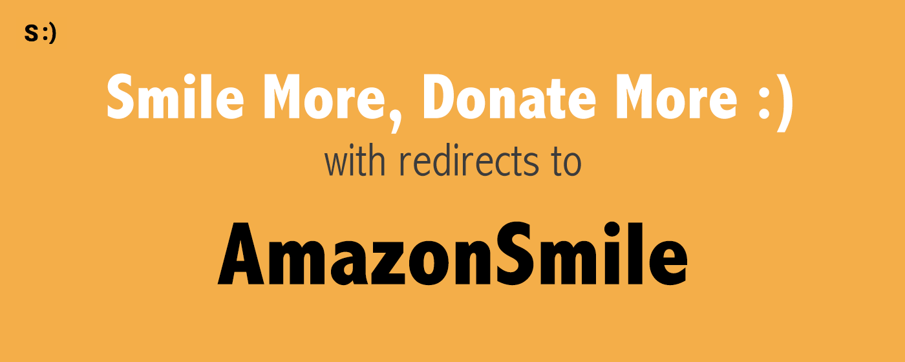

Smile More, Donate More :)
======

**Smile More, Donate More :)** is a lightweight browser extension built in JavaScript, HTML, and CSS. The extension captures any Amazon.com URL requests browsed to by the user and instead sends the browser to the AmazonSmile (https://smile.amazon.com) mirror page. AmazonSmile is Amazon's charity program for non-profit organizations. For every purchase through AmazonSmile, Amazon donates 0.5% of the price of eligible items to the user's charity organization of choice. Learn more about the [creation of this project here][project].

## Compatibility

This app is currently compatible with the following browsers:
- Chrome
- Firefox

## How to Use **Smile More, Donate More :)**

Simply add the extension to your browser of choice using one of the below download links, and it'll take care of all redirects for any future browsing.

[Free for download through Chrome's Web Store][chrome-download].
[Free for download through Mozilla's Add-Ons Page][mozilla-download].

Here's a screencast of what it looks like in action on the Chrome browser:

## Current Version

This version contains the following features:
- Amazon.com HTTP redirects to smile.amazon.com
- A link to the user's AmazonSmile impact homepage

## Privacy Guarantee

This app does not track, store, or send any user or usage information.

## Author

Joanne Yeung is a full-stack engineer in San Francisco, CA.
Learn more on LinkedIn: [https://linkedin.com/in/jttyeung][linkedin]

## License

This project is licensed under the [MIT License][license].

[project]: https://jttyeung.github.io/2017/07/02/smile-more-donate-more.html
[chrome-download]: https://chrome.google.com/webstore/detail/smile-more-donate-more/lbicnnogjkpfkhokabdopjibhlcejhop
[mozilla-download]: 
[linkedin]: https://linkedin.com/in/jttyeung
[license]: LICENSE
